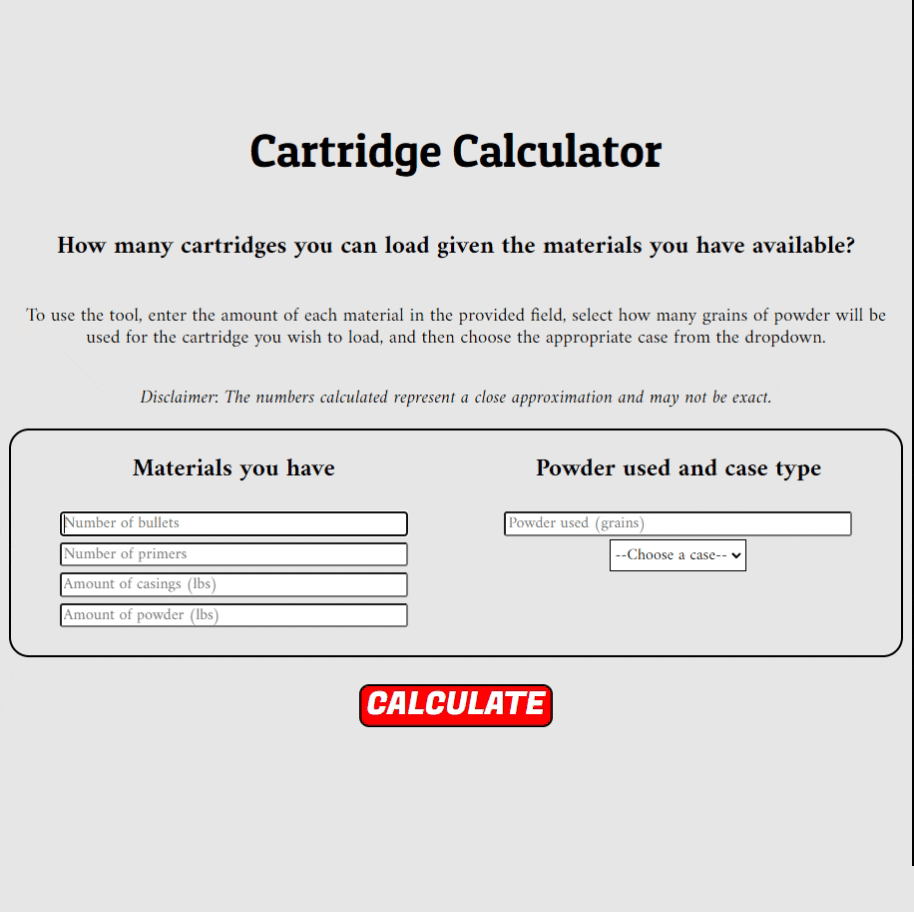

# How many cartridges can I load?
Handloading and reloading cartridges is a great way for hunters and competative shooters to address specific needs that may not be met by factory ammunition. Given the number of materials involved, I wanted a simple tool to quickly determine the amount of cartridges that can be loaded with available materials. 

**Link to project:** http://cartridge-calculator.herokuapp.com/

## 💻How It's Made:

**Tech used:** HTML, CSS, JavaScript, Node, Express, Heroku

I used Express and Node to create the server for which was rather sinple given it's a single page age with no database connection. The majority of the work fell into the HTML, JavaScript, and some CSS styling (I'm not the most artistic). The calculator runs using a single client-side function that manages the input/output of data. I used flexbox and some other smaller elements in the styling to keep the layout responsive. Everything was then pushed to Heroku. 

## 💡Optimizations

Optimizations to implement:
- Validation. Right now there is no validation on the imputs. Input values are converted from strings to numbers, but should the type be NaN, the app does not throw an error. I plan to add logic that triggers an error when a user enters either a blank input or anything other than a positive integer.  

- Styling. I want to improve the styling for mobile Safari users and plan to implement some media queries to better standardize the styling across mobile devices. 

- Additional case info. My list of available cases is not exhaustive and thus I need a means to have users submit new cases along with relevent mass. I'm not yet sure how I want to manage this. 

## 📚Lessons Learned:

When I sat down and started to think about how this would actually work, I got excited when I realized that I wouldn't need as much math as I initially thought. My big forehead-smacking moment came when I came to the conclusion that the number of cartridges that can be made was limited to the lowest amount of the materials. The ol' "You're only as strong as your weakest link" logic. Another "Aha!" moment came when I shared the app with a friend who immediately chose to test if I'd put any validation on the inputs (which I hadn't). Now I have a high-priority optimization to implement. 

